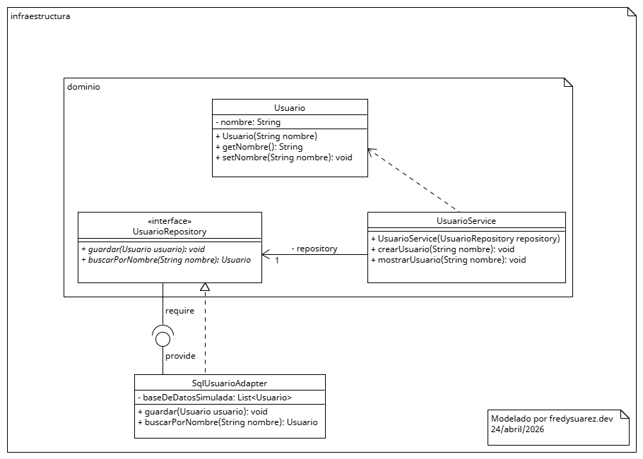
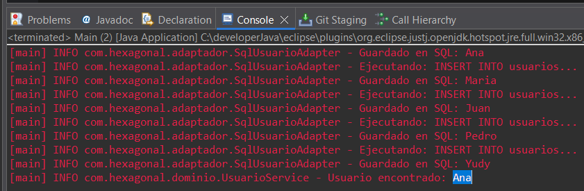

# Arquitectura Hexagonal - Ejercicio Java 21

Este es un proyecto de práctica aplicando **Arquitectura Hexagonal** (Puertos y Adaptadores) para la gestión de usuarios.

## 🚀 Tecnologías
* **Java 21**
* **SLF4J 2.0.17** (Simple Logger)

## 📁 Estructura del Proyecto
* `com.hexagonal.dominio`: Contiene la lógica de negocio y las interfaces (Puertos).
* `com.hexagonal.adaptador`: Implementaciones externas (como persistencia en SQL).
* `com.hexagonal.principal`: Punto de entrada de la aplicación.

## 🛠️ Instalación
Este proyecto no usa Maven actualmente. Para ejecutarlo:
1. Descarga los JARs de SLF4J (API y Simple) versión 2.0.17.
2. Agrégalos al **Modulepath** en el Build Path de tu IDE.
3. Asegúrate de que `module-info.java` tenga el `requires org.slf4j;`.

## 📊 Diagrama UML

---

### 🖥️ Vista Previa de la Ejecución

---

### 📈 Próximas Mejoras (Roadmap)
- [ ] Migrar a **Maven** o **Gradle** para gestión de dependencias.
- [ ] Implementar **Spring Boot 3** para la capa de Adaptadores Web.
- [ ] Añadir pruebas unitarias con **JUnit 5** y **Mockito**.
